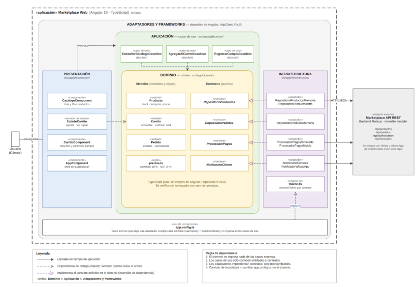

# Enfoque arquitectónico

## Clean Architecture

| Elemento | Descripción aplicada al Marketplace |
|---|---|
| **Patrón / enfoque arquitectónico** | Clean Architecture (Arquitectura Limpia). |
| **Objetivo** | Separar responsabilidades y controlar las dependencias hacia el dominio. |
| **¿Qué problema resuelve?** | Evita el acoplamiento entre la interfaz Angular, las reglas del negocio y las tecnologías externas, como bases de datos, API y servicios de pago. |
| **Capas definidas** | Presentación, Aplicación, Dominio e Infraestructura. |
| **Beneficios** | Facilita el mantenimiento y las pruebas unitarias. Permite cambiar implementaciones técnicas sin modificar innecesariamente las reglas del negocio. Mejora la organización y separación de responsabilidades del código. |

## Diagrama del enfoque arquitectónico

