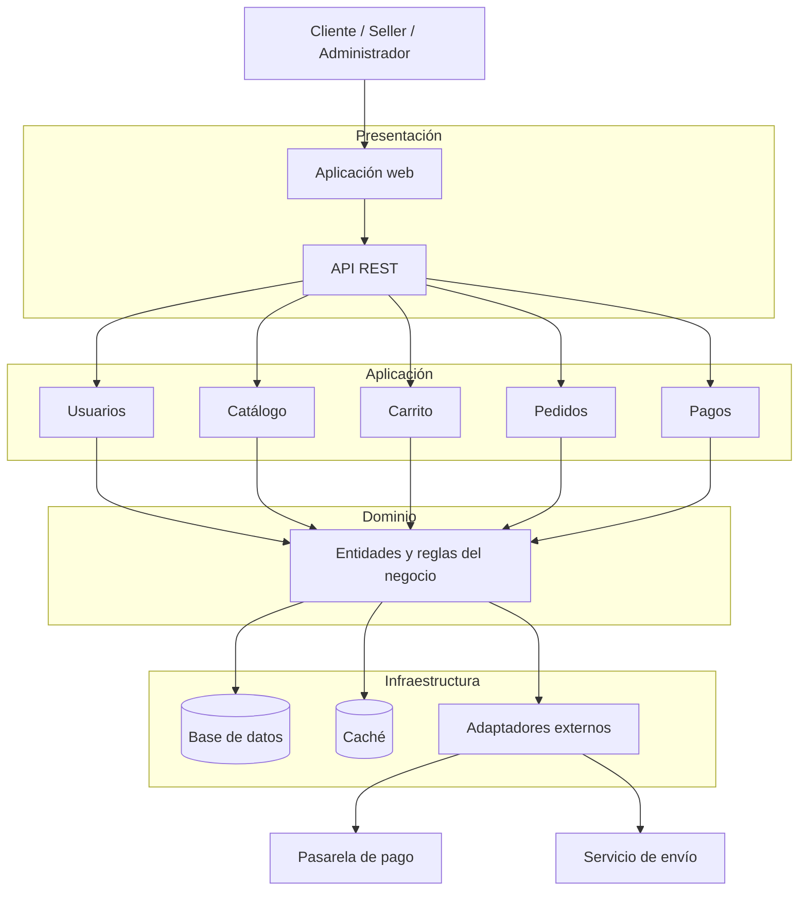

# Estilo arquitectónico del sistema

## Estilo seleccionado

El sistema utilizará un **monolito modular basado en Clean Architecture**. Todas las funcionalidades se desplegarán inicialmente como una sola aplicación, pero estarán separadas en módulos con responsabilidades definidas.

Los módulos principales serán:

- Usuarios
- Catálogo
- Carrito
- Pedidos
- Pagos

## Justificación

Este estilo responde a los drivers arquitectónicos identificados:

- **Escalabilidad:** permite aplicar escalamiento horizontal a la aplicación.
- **Rendimiento:** permite incorporar caché para consultas frecuentes.
- **Seguridad:** facilita centralizar la autenticación y autorización.
- **Integración:** utiliza adaptadores para comunicarse con servicios externos.
- **Mantenibilidad:** permite modificar un módulo sin afectar innecesariamente a los demás.

Clean Architecture separará las reglas del negocio de la interfaz, la base de datos y los servicios externos.

## Capas de la arquitectura

1. **Presentación:** interfaz web y controladores de la API REST.
2. **Aplicación:** casos de uso del sistema.
3. **Dominio:** entidades y reglas del negocio.
4. **Infraestructura:** base de datos, caché y adaptadores para servicios externos.

## Diagrama de arquitectura

## Relación entre los componentes

Los usuarios interactúan con la aplicación web, que se comunica con el backend mediante una API REST. Los módulos de aplicación ejecutan los casos de uso y aplican las reglas del dominio. La infraestructura permite almacenar los datos, utilizar caché e integrar la plataforma con la pasarela de pago y el servicio de envío.